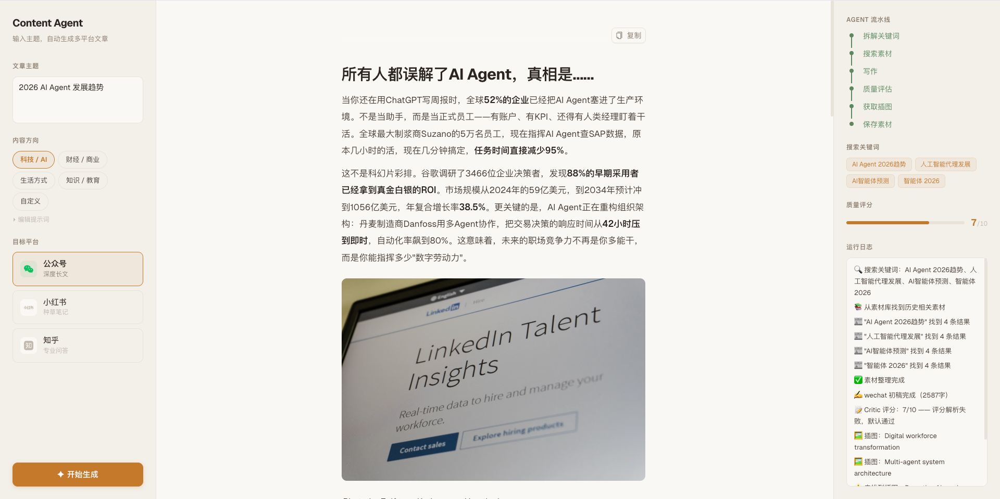

# Content Agent

基于 LangGraph + LangChain 构建的 AI 内容生产 Agent。输入主题，自动搜集资讯、生成多平台文章并配图，支持一键发布到微信公众号草稿箱。



## 功能

**内容生成**
- 多平台写作：公众号（深度长文）、小红书（种草笔记）、知乎（专业问答），自动适配各平台风格
- 内容方向预设：科技/AI、财经/商业、生活方式、知识/教育，也支持自定义方向和提示词
- 自动搜索素材：Tavily 搜索最新资讯 + LLM 提炼整理
- 质量自检：Critic 节点给初稿打分（满分 10 分），不达标自动重写
- RAG 素材库：历史素材存入本地向量库，写相关主题时自动关联复用

**AI 配图**
- 多 Provider 支持：OpenAI 兼容（含 Seedream/豆包）、Google Gemini、OpenRouter、Replicate、通义万相、Unsplash 搜图
- 统一配置：选 Provider → 填 API Key + Base URL + Model，类似 LLM 配置体验
- 8 种风格预设：温暖、新鲜、极简、概念、复古、粗体、可爱、黑板，按平台自动推荐
- 提示词占位模式：无需 API Key，直接生成绘图提示词，复制到 Gemini / ChatGPT 等免费平台生图后上传替换
- 并发控制：默认串行（避免限流），可在设置中开启并发

**文章管理**
- 主题管理：按主题组织文章，一个主题可生成多个平台版本
- 历史记录：SQLite 本地存储，支持查看、删除
- 一键复制：生成的文章可直接复制到各平台发布

**微信公众号发布**
- Markdown → 微信 HTML：内置转换器，CSS 自动内联（微信不支持 `<style>` 标签）
- 8 套主题风格：默认、优雅、极简黑、雅致、现代、暖色、绿意、红绯
- 主题预览：支持手机/PC 模式切换预览
- 图片自动上传：正文图片自动上传到微信素材库
- AI 封面提示词：根据文章内容生成封面图绘图 prompt

**可视化设置**
- 内置设置面板（⚙），无需手动编辑 .env 文件
- 支持热更新：修改配置后立即生效，无需重启后端

**可观测**
- 接入 LangSmith，每个节点的输入输出、耗时、Token 用量一目了然

## 技术栈

| 层 | 技术 |
|---|---|
| Agent 框架 | LangGraph (Python) |
| LLM | 兼容 OpenAI / Anthropic 规范的任意模型 |
| 搜索 | Tavily Search API |
| 配图 | AI 生图（OpenAI / Gemini / OpenRouter / Replicate / 通义万相）+ Unsplash 搜图 |
| RAG | Chroma (本地向量库) |
| 数据库 | SQLite (文章管理 + 配置存储) |
| HTML 转换 | markdown + Pygments + css-inline |
| API 层 | FastAPI + SSE |
| 前端 | Next.js + Ant Design |
| 可观测 | LangSmith |
| 包管理 | uv (Python) / bun (前端) |

## 项目结构

```
content-agent/
├── agent/                       # Agent 核心
│   ├── config.py                # 统一配置读取（env > SQLite > 默认值）
│   ├── graph.py                 # LangGraph 主图（节点 + 条件分支）
│   ├── state.py                 # 共享状态定义（AgentState）
│   ├── llm.py                   # LLM 工厂（支持 OpenAI / Anthropic 规范）
│   ├── memory.py                # RAG 向量库读写（Chroma）
│   ├── db.py                    # SQLite 数据库（主题 + 文章 + 设置）
│   ├── nodes/
│   │   ├── planner.py           # 拆解搜索关键词
│   │   ├── researcher.py        # 搜索 + 检索历史素材 + 提炼
│   │   ├── writer.py            # 按平台 Prompt 生成初稿
│   │   ├── critic.py            # 质量评估 + 修改建议
│   │   └── image_fetcher.py     # 配图调度（AI 生图 / Unsplash / 提示词占位）
│   ├── prompts/
│   │   └── templates.py         # 内容方向预设 + 三平台 Prompt 模板
│   ├── publish/
│   │   ├── wechat_html.py       # Markdown → 微信 HTML（内联样式）
│   │   ├── wechat_api.py        # 微信公众号 API 客户端
│   │   ├── cover_prompt.py      # AI 封面图提示词生成
│   │   └── themes/              # 8 套微信文章主题 CSS
│   └── tools/
│       ├── search.py            # Tavily 搜索
│       ├── unsplash.py          # Unsplash 图片搜索
│       └── image_gen.py         # AI 生图（多 Provider 统一接口）
├── api/
│   └── server.py                # FastAPI（SSE 生成 + CRUD + 设置 + 图片上传）
├── web/                         # Next.js 前端
│   └── app/
│       ├── page.tsx             # 主页面（三栏布局）
│       ├── theme.ts             # 暖色调主题 token
│       └── components/
│           ├── TopicList.tsx     # 主题历史列表
│           ├── InputPanel.tsx    # 新建主题（方向 + 平台 + 配图风格）
│           ├── ArticlePanel.tsx  # 文章渲染 + 提示词占位卡片 + 图片上传
│           ├── StatusPanel.tsx   # Agent 运行状态
│           ├── PublishPanel.tsx  # 微信发布（主题预览 + 封面 prompt）
│           ├── SettingsModal.tsx # 可视化设置面板
│           └── PlatformIcons.tsx # 微信/小红书/知乎 SVG 图标
├── data/                        # 本地数据（git 忽略）
│   ├── vectorstore/             # Chroma 向量库
│   ├── images/                  # 上传的配图
│   └── content-agent.db         # SQLite 数据库
├── run.py                       # CLI 入口
├── pyproject.toml
└── .env.example
```

## 快速开始

### 环境要求

- Python 3.11+
- Node.js 18+
- [uv](https://github.com/astral-sh/uv)（Python 包管理）
- [bun](https://bun.sh)（前端包管理，也可用 npm）

### 1. 克隆项目

```bash
git clone https://github.com/qiuxchao/content-agent.git
cd content-agent
```

### 2. 安装依赖

```bash
# 安装 uv（如果还没有）
curl -LsSf https://astral.sh/uv/install.sh | sh

# 安装 Python 依赖
uv sync

# 安装前端依赖
cd web && bun install && cd ..
```

### 3. 配置

有两种方式，任选其一：

**方式 A：通过 Web 设置面板（推荐）**

启动后点击左上角 ⚙ 按钮，在可视化面板中填写配置。最低只需配置：
- LLM API Key（大语言模型）
- Tavily API Key（搜索）

**方式 B：通过 .env 文件**

```bash
cp .env.example .env
```

编辑 `.env`，填入配置。

#### 必填配置

| 配置项 | 说明 | 获取地址 |
|---|---|---|
| `LLM_API_KEY` | 大语言模型 API Key | 对应服务商控制台 |
| `TAVILY_API_KEY` | 搜索 API Key | [tavily.com](https://tavily.com)（免费 1000次/月） |

#### LLM 配置示例

```bash
# DeepSeek（推荐，性价比高）
LLM_PROVIDER=openai
LLM_BASE_URL=https://api.deepseek.com
LLM_MODEL=deepseek-chat

# OpenAI
LLM_PROVIDER=openai
LLM_MODEL=gpt-5.4-mini

# 通义千问
LLM_PROVIDER=openai
LLM_BASE_URL=https://dashscope.aliyuncs.com/compatible-mode/v1
LLM_MODEL=qwen-max-latest

# Anthropic Claude
LLM_PROVIDER=anthropic
LLM_MODEL=claude-sonnet-4-6
```

#### 配图配置

配图有多种模式，在设置面板的「文章配图」中选择：

| Provider | 说明 | 需要 |
|---|---|---|
| 仅生成提示词 | 免费，输出绘图提示词，手动去 Gemini 等平台生图后上传 | 无需额外配置 |
| Unsplash | 免费摄影图搜索 | `UNSPLASH_ACCESS_KEY` |
| OpenAI 兼容 | gpt-image / DALL-E / Seedream/豆包 等 | `IMAGE_API_KEY` + `IMAGE_BASE_URL`（可选）+ `IMAGE_MODEL`（可选） |
| Google Gemini | Gemini 原生生图 | `IMAGE_API_KEY`（Gemini API Key） |
| OpenRouter | 聚合入口，可调 Gemini / FLUX 等 | `IMAGE_API_KEY`（OpenRouter Key） |
| Replicate | 托管模型，如 Google nano-banana-pro | `IMAGE_API_KEY` |
| 通义万相 | 阿里云 qwen-image | `IMAGE_API_KEY` |

#### 其他可选配置

| 配置项 | 说明 |
|---|---|
| `WECHAT_APP_ID` / `WECHAT_APP_SECRET` | 微信公众号 API，发布到草稿箱 |
| `LANGCHAIN_API_KEY` | LangSmith 调试追踪 |

### 4. 启动

#### 方式一：Web UI（推荐）

打开两个终端：

```bash
# 终端 1 — Python API
uv run uvicorn api.server:app --reload --port 8917

# 终端 2 — Next.js 前端
cd web && bun dev
```

打开 http://localhost:3917

#### 方式二：命令行

```bash
# 编辑 run.py 顶部的 TOPIC 和 PLATFORM
uv run run.py
```

## Agent 执行流程

```
用户输入主题 + 选择方向和平台
    │
    ▼
[Planner]        拆解 2~4 个搜索关键词
    │
    ▼
[Researcher]     ① 向量库检索历史素材
                 ② Tavily 搜索新素材
                 ③ LLM 整理提炼
    │
    ▼
[Writer]         按方向角色 + 平台 Prompt 生成初稿
    │
    ▼
[Critic]         打分（满分 10）
                 ≥ 7 → 继续
                 < 7 → 回到 Researcher 重写（最多 2 次）
    │
    ▼
[ImageFetcher]   AI 生图 / Unsplash 搜图 / 提示词占位
    │
    ▼
[SaveMemory]     素材存入向量库
    │
    ▼
文章保存到数据库 → 前端展示
```

## 三平台风格

| | 公众号 | 小红书 | 知乎 |
|---|---|---|---|
| 字数 | 1500~2500 | 400~600 | 1000~2000 |
| 标题 | 数字/悬念/对比式 | emoji + 口语化 | 问题式/观点式 |
| 结构 | H2 分节，逻辑层次 | 分点列举 | 先结论后论据 |
| 语气 | 有温度有观点 | 接地气，干货感 | 理性克制 |

## 自定义

### 内容方向

内置 4 个方向预设（科技/财经/生活/教育），也可以：
- 在前端选"自定义"输入方向描述
- 选预设后点"编辑提示词"微调角色设定
- 在 `agent/prompts/templates.py` 的 `DIRECTION_PRESETS` 中添加新预设

### 配图风格

8 种内置风格，按平台自动推荐（公众号=温暖、小红书=新鲜、知乎=极简），也可在生成时手动选择。风格定义在 `agent/tools/image_gen.py` 的 `STYLE_PRESETS` 中。

### 微信主题

8 套内置主题，CSS 文件在 `agent/publish/themes/` 目录下，可自行添加或修改。

### 添加新平台

1. `agent/state.py` 的 `Platform` 类型中添加新值
2. `agent/prompts/templates.py` 中添加对应的 Prompt 模板

## 调试

```bash
# .env 中配置 LangSmith
LANGCHAIN_TRACING_V2=true
LANGCHAIN_API_KEY=你的key
LANGCHAIN_PROJECT=content-agent
```

访问 [smith.langchain.com](https://smith.langchain.com) 查看完整 Trace。

```bash
# 查看 RAG 向量库内容
uv run inspect_memory.py
```

## License

MIT
